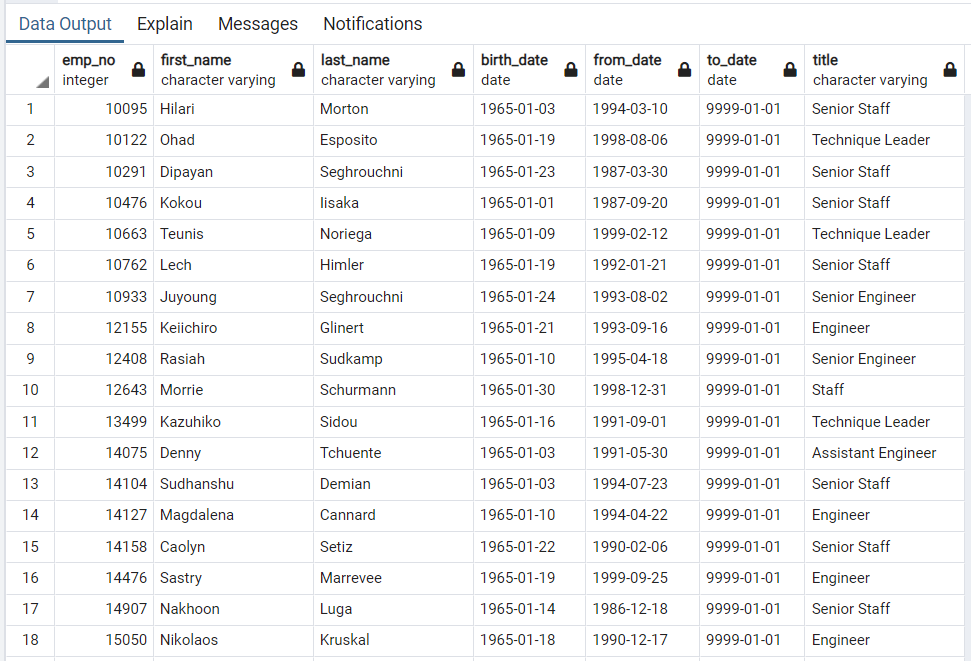
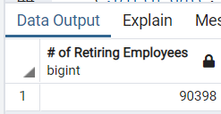
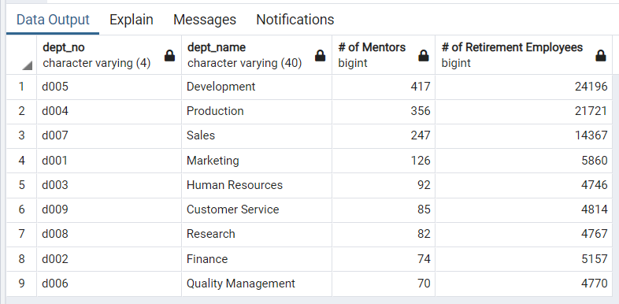

# Pewlett - Hackard Analysis

## Overview of the analysis

Pewlett - Hackard is a large company that's facing a massive number of employee retirement from the baby-boomer generation in the near future. It's looking to develop a data-driven plan on how to address the following goals: 

1. Offering a retirement package for those who meet certain criteria
2. Identifying which positions will need to filled in the near future.

To accomplish the project goals, an SQL employee database had to be built.

### Deliverables: 

1. Determine the number of retiring employees per title
2. Identify employees who are eligible to participate in a mentorship program 
3. Provide a report that summarizes the analysis and helps prepare Bobby’s manager for the “silver tsunami” as many current employees reach retirement age

### Tools and Data Sources

#### Tools

- PostgreSQL
- pgAdmin

#### Data Sources

- [departments.csv](https://2u-data-curriculum-team.s3.amazonaws.com/dataviz-online/module_7/departments.csv)
- [dept_emp.csv](https://2u-data-curriculum-team.s3.amazonaws.com/dataviz-online/module_7/dept_emp.csv)
- [dept_manager.csv](https://2u-data-curriculum-team.s3.amazonaws.com/dataviz-online/module_7/dept_manager.csv)
- [employees.csv](https://2u-data-curriculum-team.s3.amazonaws.com/dataviz-online/module_7/employees.csv)
- [salaries.csv](https://2u-data-curriculum-team.s3.amazonaws.com/dataviz-online/module_7/salaries.csv)
- [titles.csv](https://2u-data-curriculum-team.s3.amazonaws.com/dataviz-online/module_7/titles.csv)

## Results

- Created the Retirement Titles table that holds all the titles of current employees who were born between January 1, 1952 and December 31, 1955

- Removed duplicates and kept only the most recent title of each employee in the Unique Titles table

- Retrieved the number of employees by their most recent job title who are about to retire into the Retiring Titles table

- Created a Mentorship Eligibility table that holds the current employees who were born between January 1, 1965 and December 31, 1965

## Summary 

### How many roles will need to be filled as the "silver tsunami" begins to make an impact?

In total, **90,398 roles** will need to be backfilled to cover for the upcoming retirements.

### Are there enough qualified, retirement-ready employees in the departments to mentor the next generation of Pewlett Hackard employees?

There are very few qualified retirement-ready employees to mentor the next generation: only **1,549 potential mentors** for the **90,398 roles** that need to be hired and mentored.

The breakdown of mentors and retirees by Department is presented in the table below. The source code of the query is [here](Queries/Deliverable_3.sql)

